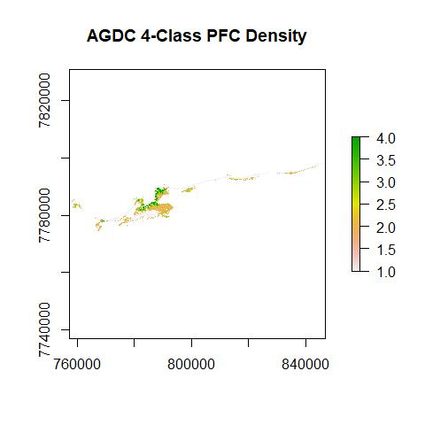

AGDC NDVI to PFC
================
Bart Huntley
20 April, 2018

-   [Introduction](#introduction)
-   [Methods](#methods)
    -   [AGDC data import](#agdc-data-import)
    -   [Model PFC](#model-pfc)
    -   [PFC layer outputs](#pfc-layer-outputs)

Introduction
------------

A method to take an NDVI product created from NBAR Landsat data from the Data Cube to PFC for mangroves located at Eighty Mile Beach, Western Australia.

Methods
-------

One common co-ordinate reference system is required and all data will be projected to GDA94 MGA50 (EPSG 28350) as this is what was used for the original work.

Some shape files are required for cropping data and extracting field calibration site data NDVI. They are imported and projected.

``` r
# Required packages
library(raster)
library(rgdal)
library(tidyverse)
library(broom)
library(knitr)

# Get shape for extent
shp <- readOGR("./data", layer = "full_eighty_mile_extent_MGA50", 
               verbose = FALSE)
shp50 <- spTransform(shp, 
                     paste("+proj=utm +zone=50 +south +ellps=GRS80", 
                           "+towgs84=0,0,0,0,0,0,0 +units=m +no_defs"))

# Get calibration site locations and correct projection
shp_sites <- readOGR(dsn = "./data", layer = "eighty_mile_sites", 
                     verbose = FALSE)
shp50_sites <- spTransform(shp_sites, 
                           paste("+proj=utm +zone=50 +south +ellps=GRS80", 
                                 "+towgs84=0,0,0,0,0,0,0 +units=m +no_defs"))
# Grab CRS for later projections
MGA50_crs <- crs(shp50)
```

### AGDC data import

An NDVI product, exported from the Data Cube, is imported and re-projected. The `raster()` function in R does not quite handle the CRS of the netcdf file and the EPSG code for Australian Albers needs to be supplied.

``` r
# Grab GA Cube netcdf and set correct albers EPSG
ga_ndvi <- raster("./data/2015-06-22_eighty_mile_NDVI_nfmask.nc")
crs(ga_ndvi) <- "+init=EPSG:3577" #albers EPSG

# Re-project agdc NDVI raster
ga_ndvi_MGA50 <- projectRaster(ga_ndvi, crs = MGA50_crs)

# Crop data set to extent
ga_ndvi_MGA50 <- crop(ga_ndvi_MGA50, shp50)
```

Mean AGDC NDVI values for each calibration site are extracted, one site not used in the regression is removed and the results stored in a data frame.

``` r
# Extract data for sites
ga_ndvi_sites <- raster::extract(ga_ndvi_MGA50, shp50_sites, fun=mean, 
                                 na.rm=TRUE)

# Put results and site id's in data frame and remove site "19_85" - not used 
# in original regression
df_ga <- data.frame(site = shp50_sites@data$SiteID, 
                               agdc = ga_ndvi_sites) %>%
  dplyr::filter(site != "19_85")
```

### Model PFC

The original field measures are imported and a model data frame is made.

``` r
df_mod <- read_csv("./data/80mile_mangrove_field_pfc.csv") %>%
  dplyr::full_join(df_ga, by = "site") %>%
  dplyr::rename(field = field_pfc)
```

A linear model is created.

``` r
agdc_mod <- lm(df_mod$field ~ df_mod$agdc)
tidy(agdc_mod)
```

             term  estimate std.error statistic      p.value
    1 (Intercept) -5.672309  5.385798 -1.053197 3.100893e-01
    2 df_mod$agdc 91.381393  9.503851  9.615196 1.515433e-07

``` r
glance(agdc_mod)
```

      r.squared adj.r.squared    sigma statistic      p.value df    logLik
    1 0.8684853     0.8590914 8.174907    92.452 1.515433e-07  2 -55.25187
           AIC      BIC deviance df.residual
    1 116.5037 118.8215 935.6073          14

### PFC layer outputs

NDVI is converted to PFC using the model coefficients.

``` r
# PFC raster
agdc_pfc_raster <- calc(ga_ndvi_MGA50, fun = function(x) {
  coef(agdc_mod)[2] * x - coef(agdc_mod)[1]
})
```

In the original work, the PFC rasters were saved to disk for further processing (to polygons for example). At this stage the data was converted to 8 bit unsigned when saved out from ERMapper. To recreate this the data has negative values zeroed and remaining values rounded. Also at this stage it was determined that all PFC values less than 10 were to be zeroed to remove noise.

``` r
# reduce to 8 bit via Kathy method
agdc_pfc_raster[agdc_pfc_raster < 10] <- 0
agdc_pfc_raster_8bit <- round(agdc_pfc_raster)
```

To further reduce noise and clean the landward side of the mangroves, a land mask was applied. The land mask needed to be resampled to 25 metre resolution to match the AGDC data.

``` r
# Import the land raster mask
land <- raster("./data/80mile_indvi_mangroves_1988_2015_landedit_FINAL_z50.img")

# Ensure projections are the same
land_agdc <- projectRaster(land, agdc_pfc_raster_8bit)

# Need to resample land mask to different resolution of agdc data (25x25m)
land_agdc <- resample(land_agdc, agdc_pfc_raster_8bit)
agdc_pfc_mskd <- mask(agdc_pfc_raster_8bit, land_agdc, inverse = TRUE)
```

Next the PFC raster is reclassified according to the original work. A plot is created as a check.

``` r
# Create classification matrix
reclass <- c(
  -Inf, 1, NA,
  1, 13, 1,
  13, 29, 2,
  29, 59, 3,
  59, Inf, 4
)
reclass_m <- matrix(reclass, ncol = 3, byrow = TRUE)

# Reclassify the PFC raster
agdc_4class <- reclassify(agdc_pfc_mskd, reclass_m)

# Plot call to check results
plot(agdc_4class, main = "AGDC 4-Class PFC Density")
```



If an export of the data is required the following can be run

``` r
# export data
writeRaster(agdc_4class, filename = "./agdc_4class.img", 
            datatype = "INT1U", overwrite=TRUE)

writeRaster(agdc_pfc_mskd, filename = "./agdc_pfc_mskd.img", 
            datatype = "FLT4S", overwrite=TRUE)

writeRaster(ga_ndvi_MGA50, filename = "./agdc_ndvi.img", 
            datatype = "FLT4S", overwrite=TRUE)
```
