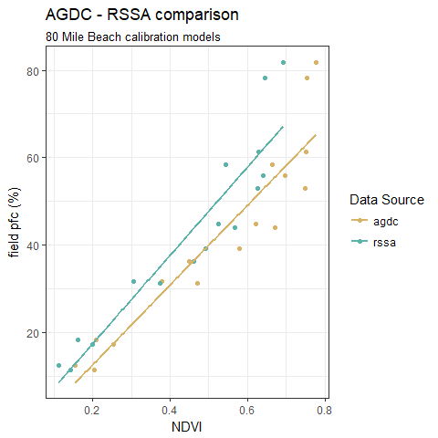
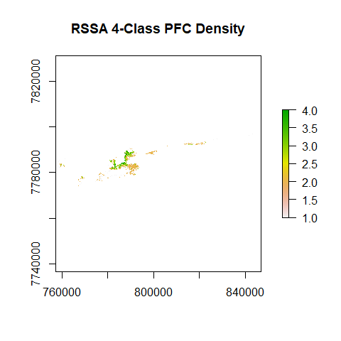
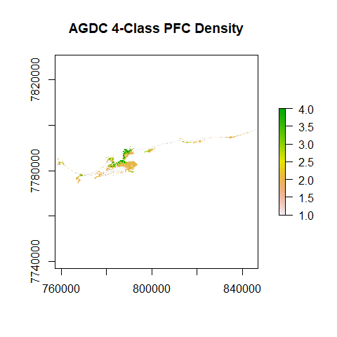
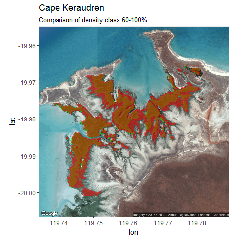
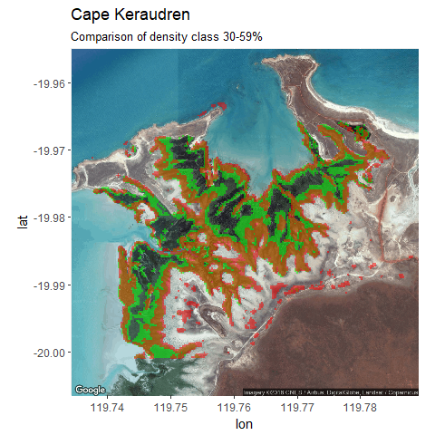
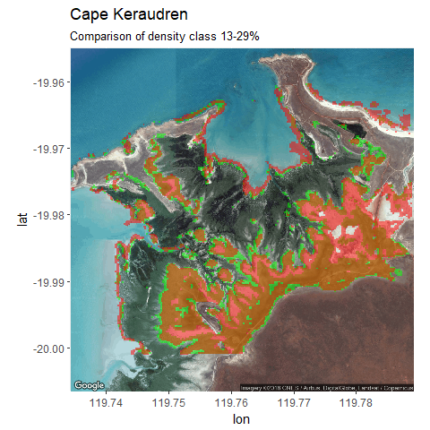
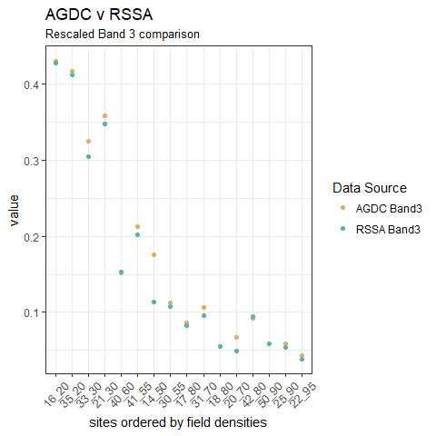
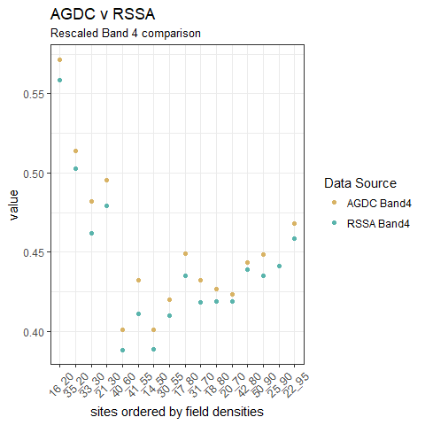

Comparison of PFC products
================
Bart Huntley
20 April, 2018

-   [Introduction](#introduction)
-   [Methods](#methods)
    -   [AGDC data import](#agdc-data-import)
    -   [RSSA data import](#rssa-data-import)
    -   [Model PFC](#model-pfc)
    -   [PFC layer outputs](#pfc-layer-outputs)
-   [Comparisons](#comparisons)
    -   [By area stats](#by-area-stats)
    -   [Visualisation](#visualisation)
    -   [Band 3 and 4 values](#band-3-and-4-values)

Introduction
------------

The Remote Sensing and Spatial Analysis group (RSSA) from the Department of Biodiversity, Conservation and Attractions (DBCA) create a projected foliage cover (PFC) product to monitor mangrove density in management areas. One such management area is Eighty Mile Beach in the Kimberley region of Western Australia.

To create a PFC product, field measurements of PFC and normalised difference vegetation index (NDVI) values obtained from Landsat imagery are modelled in a linear regression. Coefficients of the regression are then used to calculate PFC rasters that cover the extent of the management areas. The PFC values in these raster are binned into density classes to aid in reporting and visualisation.

The aim of this analysis is to use field measurements obtained for Eighty Mile Beach, Landsat data extracted from the Data Cube and the methods outlined above to create an AGDC version of PFC that can be compared to PFC created by the RSSA group. The main point of difference involves the Landsat data. The local Landsat archive maintained by the RSSA group is processed to top of atmosphere and BRDF corrected (using CSIRO methods) but remains as 8 bit digital numbers whereas the Data Cube is surface reflectance.

The PFC products produced in the following analysis are created from Landsat data captured on the 22nd of June, 2015. The code below:

-   produces a RSSA PFC product from downloaded and processed USGS imagery.
-   produces an AGDC PFC product from an NDVI raster produced from NBAR data on the Data Cube.
-   highlights some differences between regression models, PFC products and the processed Landsat bands used to create NDVI.

Methods
-------

One common co-ordinate reference system is required and all data will be projected to GDA94 MGA50 (EPSG 28350) as this is what was used for the original work.

Some shape files are required for cropping data and extracting field calibration site data NDVI. They are imported and projected.

``` r
# Required packages
library(raster)
library(rgdal)
library(tidyverse)
library(broom)
library(knitr)

# Get shape for extent
shp <- readOGR("../shp", layer = "full_eighty_mile_extent_MGA50", 
               verbose = FALSE)
shp50 <- spTransform(shp, 
                     paste("+proj=utm +zone=50 +south +ellps=GRS80", 
                           "+towgs84=0,0,0,0,0,0,0 +units=m +no_defs"))

# Get calibration site locations and correct projection
shp_sites <- readOGR(dsn = "../shp", layer = "eighty_mile_sites", 
                     verbose = FALSE)
shp50_sites <- spTransform(shp_sites, 
                           paste("+proj=utm +zone=50 +south +ellps=GRS80", 
                                 "+towgs84=0,0,0,0,0,0,0 +units=m +no_defs"))
# Grab CRS for later projections
MGA50_crs <- crs(shp50)
```

### AGDC data import

An NDVI product, exported from the Data Cube, is imported and re-projected. The `raster()` function in R does not quite handle the CRS of the netcdf file and the EPSG code for Australian Albers needs to be supplied.

``` r
# Grab GA Cube netcdf and set correct albers EPSG
ga_ndvi <- raster("../2015-06-22_eighty_mile_NDVI_nfmask.nc")
crs(ga_ndvi) <- "+init=EPSG:3577" #albers EPSG

# Re-project agdc NDVI raster
ga_ndvi_MGA50 <- projectRaster(ga_ndvi, crs = MGA50_crs)

# Crop data set to extent
ga_ndvi_MGA50 <- crop(ga_ndvi_MGA50, shp50)
```

Mean AGDC NDVI values for each calibration site are extracted, one site not used in the regression is removed and the results stored in a data frame.

``` r
# Extract data for sites
ga_ndvi_sites <- raster::extract(ga_ndvi_MGA50, shp50_sites, fun=mean, 
                                 na.rm=TRUE)

# Put results and site id's in data frame and remove site "19_85" - not used 
# in original regression
df_ga <- data.frame(site = shp50_sites@data$SiteID, 
                               agdc = ga_ndvi_sites) %>%
  dplyr::filter(site != "19_85")
```

### RSSA data import

The RSSA data is read in as a stack/brick as the source data is a multiband raster. It is cropped then converted to an NDVI raster layer and re-projected.

``` r
# Start with whole processed scene
path <- "W:/usgs/112074/20150622/"
scene <- "l8ut11274m_220615_USG_utm50pre.ers"

# Create multilayer brick and crop to extent of shp
rssa_brick <- brick(paste0(path, scene))
rssa_brick_crop <- crop(rssa_brick, shp50)

# NDVI function
NDVI <- function(img, n, r) {
  nir <- img[[n]]
  red <- img[[r]]
  vi <- (nir - red) / (nir + red)
  return(vi)
}

# Apply the function to the brick
rssa_ndvi_raster <- NDVI(rssa_brick_crop, 4, 3)

# Re-project rssa NDVI raster
rssa_ndvi_MGA50 <- projectRaster(rssa_ndvi_raster, crs= MGA50_crs)
```

Mean RSSA NDVI values for each calibration site are extracted, one site not used in the regression is removed and the results stored in a data frame.

``` r
# Extract data for sites
rssa_ndvi_sites <- raster::extract(rssa_ndvi_MGA50, shp50_sites, fun = mean, 
                                    na.rm = TRUE)

# Put results and site id's in data frame and remove site "19_85" - not used 
# in original regression
df_rssa <- data.frame(site = shp50_sites@data$SiteID, 
                               rssa = rssa_ndvi_sites) %>%
  dplyr::filter(site != "19_85")
```

### Model PFC

The original field measures are imported and a model data frame is made with all variables.

``` r
df_mod <- read_csv("../RSSA_method/80mile_mangrove_field_pfc.csv") %>%
  dplyr::full_join(df_ga, by = "site") %>%
  dplyr::full_join(df_rssa, by = "site") %>%
  dplyr::rename(field = field_pfc)
```

Linear models are created. Firstly the AGDC Field ~ NDVI model.

``` r
agdc_mod <- lm(df_mod$field ~ df_mod$agdc)
tidy(agdc_mod)
```

             term  estimate std.error statistic      p.value
    1 (Intercept) -5.672309  5.385798 -1.053197 3.100893e-01
    2 df_mod$agdc 91.381393  9.503851  9.615196 1.515433e-07

``` r
glance(agdc_mod)
```

      r.squared adj.r.squared    sigma statistic      p.value df    logLik
    1 0.8684853     0.8590914 8.174907    92.452 1.515433e-07  2 -55.25187
           AIC      BIC deviance df.residual
    1 116.5037 118.8215 935.6073          14

The RSSA Field ~ NDVI model.

``` r
rssa_mod <- lm(df_mod$field ~ df_mod$rssa)
tidy(rssa_mod)
```

             term   estimate std.error  statistic      p.value
    1 (Intercept)  -2.732432  5.054466 -0.5405976 5.972813e-01
    2 df_mod$rssa 101.026917 10.402384  9.7119007 1.340096e-07

``` r
glance(rssa_mod)
```

      r.squared adj.r.squared    sigma statistic      p.value df    logLik
    1 0.8707545     0.8615227 8.104073  94.32101 1.340096e-07  2 -55.11263
           AIC     BIC deviance df.residual
    1 116.2253 118.543  919.464          14

And visualised.

``` r
# Make data long - easier to work with
df_plot <- df_mod %>%
  gather("source", "ndvi", 3:4)

ggplot(df_plot, aes(x=ndvi, y=field, color=source)) +
  geom_point() +
  geom_smooth(method=lm, se=FALSE)+
  scale_colour_manual(values=c("#d8b365", "#5ab4ac"),
                      name="Data Source")+
  theme_bw() +
  labs(title="AGDC - RSSA comparison",
       subtitle="80 Mile Beach calibration models",
       x = "NDVI",
       y = "field pfc (%)")
```



### PFC layer outputs

To compare PFC density raster outputs firstly the model coefficients need to be applied to the appropriate NDVI data.

``` r
# PFC raster layers
rssa_pfc_raster <- calc(rssa_ndvi_MGA50, fun = function(x) {
  coef(rssa_mod)[2] * x - coef(rssa_mod)[1]
})


agdc_pfc_raster <- calc(ga_ndvi_MGA50, fun = function(x) {
  coef(agdc_mod)[2] * x - coef(agdc_mod)[1]
})
```

In the original work, the PFC rasters were saved to disk for further processing (to polygons for example). At this stage the data was converted to 8 bit unsigned when saved out from ERMapper. To recreate this the data has negative values zeroed and remaining values rounded. Also at this stage it was determined that all PFC values less than 10 were to be zeroed to remove noise.

``` r
# reduce to 8 bit via Kathy method
rssa_pfc_raster[rssa_pfc_raster < 10] <- 0
rssa_pfc_raster_8bit <- round(rssa_pfc_raster)

agdc_pfc_raster[agdc_pfc_raster < 10] <- 0
agdc_pfc_raster_8bit <- round(agdc_pfc_raster)
```

To further reduce noise and clean the landward side of the mangroves, a land mask was applied to the RSSA data.

``` r
# Import the land raster mask
land <- raster("../shp/80mile_indvi_mangroves_1988_2015_landedit_FINAL_z50.img")

# Ensure projections are the same
land <- projectRaster(land, rssa_pfc_raster_8bit)

# Apply the mask
rssa_pfc_mskd <- mask(rssa_pfc_raster_8bit, land, inverse = TRUE)
```

The land mask needed to be resampled to 25 metre resolution to match the AGDC data.

``` r
# Need to resample land mask to different resolution of agdc data (25x25m)
land_agdc <- land
land_agdc <- resample(land_agdc, agdc_pfc_raster_8bit)
agdc_pfc_mskd <- mask(agdc_pfc_raster_8bit, land_agdc, inverse = TRUE)
```

Next the PFC rasters are reclassified according to the original work. Plots are created as a check.

``` r
# Create classification matrix
reclass <- c(
  -Inf, 1, NA,
  1, 13, 1,
  13, 29, 2,
  29, 59, 3,
  59, Inf, 4
)
reclass_m <- matrix(reclass, ncol = 3, byrow = TRUE)

# Reclassify the PFC rasters
rssa_4class <- reclassify(rssa_pfc_mskd, reclass_m)
agdc_4class <- reclassify(agdc_pfc_mskd, reclass_m)

# Plot call to check results
plot(rssa_4class, main = "RSSA 4-Class PFC Density")
plot(agdc_4class, main = "AGDC 4-Class PFC Density")
```



Comparisons
-----------

### By area stats

The count of pixels can be used to calculate areas per class as a way of comparing the two outputs.

``` r
# Get frequencies of RSSA PFC classes and calc hectares
df_rssa_4class <- as.data.frame(freq(rssa_4class)) %>%
  dplyr::slice(2:4) %>%
  dplyr::select(-value) %>%
  dplyr::mutate(value = 2:4) %>%
  dplyr::rename(rssa = count)

# Be careful of different pixel sizes affecting area calcs
df_compare <- as.data.frame(freq(agdc_4class)) %>%
  dplyr::slice(2:4) %>%
  dplyr::rename(agdc = count) %>%
  dplyr::full_join(df_rssa_4class, by = "value") %>%
  tidyr::gather("source", "count", 2:3) %>%
  dplyr::mutate(hectare = ifelse(source == "rssa", count * 0.09, 
                                 count * 0.0625)) %>%
  dplyr::group_by(source, value) %>%
  dplyr::summarise(area = sum(hectare)) %>%
  tidyr::spread(source, area) %>%
  dplyr::mutate(difference = rssa - agdc) %>%
  dplyr::mutate(percent = difference/rssa *100) %>%
  dplyr::mutate(value = ifelse(value == 2, "dens 14-29",
                               ifelse(value == 3, "dens 30-59", 
                                      "dens 60-100"))) %>%
  dplyr::rename(density = value)

kable(df_compare)
```

| density     |      agdc|     rssa|  difference|    percent|
|:------------|---------:|--------:|-----------:|----------:|
| dens 14-29  |  5414.312|  3161.79|   -2252.523|  -71.24200|
| dens 30-59  |  1445.500|  1232.37|    -213.130|  -17.29432|
| dens 60-100 |   849.250|   443.34|    -405.910|  -91.55727|

In the table above, *agdc* and *rssa* are areas in hectares respectively, *difference* is *rssa - agdc* and *percent* is the percentage difference.

### Visualisation

From the table above, the AGDC areas per density class are consistently larger. The extent differences are best visualised on a smaller portion of the overall reporting area.

The PFC data is reclassified and cropped to display a smaller area. It is also reprojected to WGS84 and polygonised to display with Google imagery.

``` r
## Display work

# Grab display extent
shp50_display <- readOGR(dsn = "../shp", layer = "display_extent_MGA50", 
                         verbose = FALSE)

# WGS84 crs
WGS84_crs <- CRS("+proj=longlat +ellps=WGS84 +datum=WGS84 +no_defs")
## Create dense (60-100) and medium (30-59) rasters

# Create dense classification matrix
reclassD <- c(
  -Inf, 59, NA,
  59, Inf, 1
)
reclass_m_dense <- matrix(reclassD, ncol = 3, byrow = TRUE)

# Reclassify the PFC rasters
rssa_Dclass <- reclassify(rssa_pfc_mskd, reclass_m_dense)
agdc_Dclass <- reclassify(agdc_pfc_mskd, reclass_m_dense)

# Crop to display extent
rssa_dense <- raster::crop(rssa_Dclass, shp50_display)
agdc_dense <- raster::crop(agdc_Dclass, shp50_display)

# Create medium classification matrix
reclassM <- c(
  -Inf, 29, NA,
  29, 59, 1,
  59, Inf, NA
)
reclass_m_medium <- matrix(reclassM, ncol = 3, byrow = TRUE)

# Reclassify the PFC rasters
rssa_Mclass <- reclassify(rssa_pfc_mskd, reclass_m_medium)
agdc_Mclass <- reclassify(agdc_pfc_mskd, reclass_m_medium)

# Crop to display extent
rssa_medium <- raster::crop(rssa_Mclass, shp50_display)
agdc_medium <- raster::crop(agdc_Mclass, shp50_display)

# Create sparse classification matrix
reclassS <- c(
  -Inf, 13, NA,
  13, 29, 1,
  29, Inf, NA
)
reclass_m_sparse <- matrix(reclassS, ncol = 3, byrow = TRUE)

# Reclassify the PFC rasters
rssa_Sclass <- reclassify(rssa_pfc_mskd, reclass_m_sparse)
agdc_Sclass <- reclassify(agdc_pfc_mskd, reclass_m_sparse)

# Crop to display extent
rssa_sparse <- raster::crop(rssa_Sclass, shp50_display)
agdc_sparse <- raster::crop(agdc_Sclass, shp50_display)

# Create polygon - CRS in ggmap is WGS84
# Dense
rssa_denseWGS84 <- projectRaster(rssa_dense, 
                                 crs = WGS84_crs)
rdp <- rasterToPolygons(rssa_denseWGS84)

agdc_denseWGS84 <- projectRaster(agdc_dense, 
                                 crs = WGS84_crs)
adp <- rasterToPolygons(agdc_denseWGS84)

# Medium
rssa_mediumWGS84 <- projectRaster(rssa_medium, 
                                 crs = WGS84_crs)
rmp <- rasterToPolygons(rssa_mediumWGS84)

agdc_mediumWGS84 <- projectRaster(agdc_medium, 
                                 crs = WGS84_crs)
amp <- rasterToPolygons(agdc_mediumWGS84)

# Sparse
rssa_sparseWGS84 <- projectRaster(rssa_sparse, 
                                  crs = WGS84_crs)
rsp <- rasterToPolygons(rssa_sparseWGS84)

agdc_sparseWGS84 <- projectRaster(agdc_sparse, 
                                  crs = WGS84_crs)
asp <- rasterToPolygons(agdc_sparseWGS84)
```

Below is the visualisation for Cape Keraudren for density class 60-100%. The RSSA data is displayed as green and the AGDC data as red. Where the two datasets agree a yellow colour is displayed.

``` r
library(ggmap)
#  Display image extents in WGS84 lat long
disp_box <- c(119.73451, -20.00082, 119.78890, -19.96056)

# Get display base imagery from Google API and create map object
disp_map <- get_map(location = disp_box, maptype = "satellite", source = "google")
dense <- ggmap(disp_map)

# Add polygonised density data
dense2 <- dense + 
  geom_polygon(data = rdp, 
               aes(x = long, y = lat, group = group),
               fill = "green",
               size = 0, 
               alpha = 0.5) +
  geom_polygon(data = adp, 
               aes(x = long, y = lat, group = group),
               fill = "red",
               size = 0, 
               alpha = 0.5)

# Titles
dense2 + labs(title = "Cape Keraudren",
              subtitle = "Comparison of density class 60-100%")
```



Below is the visualisation for Cape Keraudren for density class 30-59%. The RSSA data is displayed as green and the AGDC data as red. Where the two datasets agree a yellow colour is displayed.

``` r
# Create map object using same base imagery data
medium <- ggmap(disp_map)

# Add polygonised density data
medium2 <- medium +
  geom_polygon(data = rmp, 
               aes(x = long, y = lat, group = group),
               fill = "green",
               size = 0, 
               alpha = 0.5) +
  geom_polygon(data = amp, 
               aes(x = long, y = lat, group = group),
               fill = "red",
               size = 0, 
               alpha = 0.5)

# Titles
medium2 + labs(title = "Cape Keraudren",
               subtitle = "Comparison of density class 30-59%")
```



Below is the visualisation for Cape Keraudren for density class 13-29%. The RSSA data is displayed as green and the AGDC data as red. Where the two datasets agree a yellow colour is displayed.

``` r
# Create map object using same base imagery data
sparse <- ggmap(disp_map)

# Add polygonised density data
sparse2 <- medium +
  geom_polygon(data = rsp, 
               aes(x = long, y = lat, group = group),
               fill = "green",
               size = 0, 
               alpha = 0.5) +
  geom_polygon(data = asp, 
               aes(x = long, y = lat, group = group),
               fill = "red",
               size = 0, 
               alpha = 0.5)

# Titles
sparse2 + labs(title = "Cape Keraudren",
               subtitle = "Comparison of density class 13-29%")
```



The ggmap package is used above and more details about it can be found in: *D. Kahle and H. Wickham. ggmap: Spatial Visualization with ggplot2. The R Journal, 5(1), 144-161.*

### Band 3 and 4 values

Lastly, comparing the data at the band level could be instructive. NBAR band 3 and 4 values were exported from the Data Cube, re-projected, cropped, rescaled from 0 to 1. Mean values from the field sites were extracted. A similar process was undertaken with the RSSA data.

``` r
# Grab GA Cube netcdf and set correct albers EPSG
agdc_b3 <- raster("../2015-06-22_eighty_mile_NBAR3_nofmask.nc")
agdc_b4 <- raster("../2015-06-22_eighty_mile_NBAR4_nofmask.nc")
crs(agdc_b3) <- "+init=EPSG:3577" #albers EPSG
crs(agdc_b4) <- "+init=EPSG:3577" #albers EPSG

# Re-project agdc NDVI raster
agdc_b3_MGA50 <- projectRaster(agdc_b3, crs = MGA50_crs)
agdc_b4_MGA50 <- projectRaster(agdc_b4, crs = MGA50_crs)

# Crop data set to extent
agdc_b3_MGA50 <- crop(agdc_b3_MGA50, shp50)
agdc_b4_MGA50 <- crop(agdc_b4_MGA50, shp50)


# Function to rescale cell values between 0 and 1
rasterRescale<-function(r){
  ((r-cellStats(r,"min"))/(cellStats(r,"max")-cellStats(r,"min")))
}

agdc_b3_MGA50r <- rasterRescale(agdc_b3_MGA50)
agdc_b4_MGA50r <- rasterRescale(agdc_b4_MGA50)

# Extract data for sites
agdc_b3_sites <- raster::extract(agdc_b3_MGA50r, shp50_sites, fun=mean, 
                                 na.rm=TRUE)
agdc_b4_sites <- raster::extract(agdc_b4_MGA50r, shp50_sites, fun=mean, 
                                 na.rm=TRUE)

# Put results and site id's in data frame and remove site "19_85" - not used 
# in original regression
agdc_bdf <- data.frame(site = shp50_sites@data$SiteID, 
                    aB3 = agdc_b3_sites,
                    aB4 = agdc_b4_sites) %>%
  dplyr::filter(site != "19_85")

# Grab rssa data from cropped brick
rssa_b3_MGA50 <- rssa_brick_crop[[3]]
rssa_b4_MGA50 <- rssa_brick_crop[[4]]

# Rescale to plot on same scale
rssa_b3_MGA50r <- rasterRescale(rssa_b3_MGA50)
rssa_b4_MGA50r <- rasterRescale(rssa_b4_MGA50)

# Extract data for sites
rssa_b3_sites <- raster::extract(rssa_b3_MGA50r, shp50_sites, fun=mean, 
                                 na.rm=TRUE)
rssa_b4_sites <- raster::extract(rssa_b4_MGA50r, shp50_sites, fun=mean, 
                                 na.rm=TRUE)

# Put results and site id's in data frame and remove site "19_85" - not used 
# in original regression
rssa_bdf <- data.frame(site = shp50_sites@data$SiteID, 
                       rB3 = rssa_b3_sites,
                       rB4 = rssa_b4_sites) %>%
  dplyr::filter(site != "19_85")
```

The values were all rescaled between 0 and 1 so that results could graphed on the same scale. The data is then joined along with the original field estimates of PFC. This was done so that the graphs could be ordered by density of the sites along the x axis.

``` r
# Grab field cover measurements to order sites by
field_pfc <- read_csv("../RSSA_method/80mile_mangrove_field_pfc.csv")

# Join all data together
bands_df <- agdc_bdf %>%
  dplyr::full_join(rssa_bdf, by = "site") %>%
  dplyr::full_join(field_pfc, by = "site") %>%
  tidyr::gather("source", "value", 2:5)

# Separate out a separate band 3 and band 4 version for plotting
band3_df <- bands_df %>%
  filter(source == "aB3" | source == "rB3")

band4_df <- bands_df %>%
  filter(source == "aB4" | source == "rB4")
```

Lastly the band 3 and band 4 rescaled values can be ploted for comparison.

``` r
ggplot(band3_df) +
  geom_point(aes(x = fct_reorder(site, field_pfc), y = value, colour = source)) +
  theme_bw() +
  theme(axis.text.x = element_text(angle = 45, vjust=0.5)) +
  scale_colour_manual(values=c("#d8b365", "#5ab4ac"),
                      name="Data Source",
                      labels = c("AGDC Band3", "RSSA Band3")) +
  labs(title = "AGDC v RSSA",
       subtitle = "Rescaled Band 3 comparison",
       x = "sites ordered by field densities")
```



``` r
ggplot(band4_df) +
  geom_point(aes(x = fct_reorder(site, field_pfc), y = value, colour = source)) +
  theme_bw() +
  theme(axis.text.x = element_text(angle = 45, vjust=0.5)) +
  scale_colour_manual(values=c("#d8b365", "#5ab4ac"),
                      name="Data Source",
                      labels = c("AGDC Band4", "RSSA Band4")) +
  labs(title = "AGDC v RSSA",
       subtitle = "Rescaled Band 4 comparison",
       x = "sites ordered by field densities")
```



The AGDC values are on average greater in value than the RSSA values.
